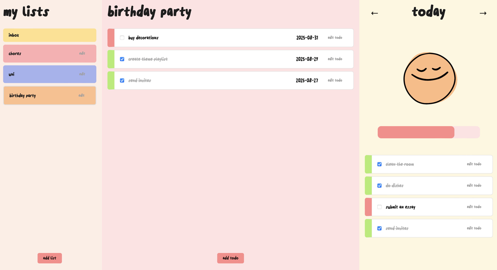

# todo-app

**todo-app** is a lightweight, single-page task management tool built with modular vanilla JavaScript. It features an intuitive list-based interface and a daily view to help you track tasks and visualize your progress. All UI elements and illustrations were custom-designed and implemented by me.

live preview - https://ssendns.github.io/todo-app/

  

## features

- **modular JavaScript architecture** (ES Modules)
- **custom task lists** — create, edit, delete, and color-code
- **daily view** — tasks are organized by due date with a dynamic progress indicator
- **persistent state** — all data is saved in localStorage and automatically restored
- **all illustrations** were hand-drawn by me

## tech stack

- vanilla JavaScript (ES6+)
- HTML & CSS
- LocalStorage for persistence
- Webpack for bundling

## what I learned

- how to structure a full SPA with modular vanilla JavaScript
- managing application state through LocalStorage
- building scalable, testable UI logic without relying on frameworks
- designing a user experience with minimal overhead and clean interaction patterns

---

If this project speaks to you, feel free to [connect with me](https://github.com/ssendns). I am always open to collaborating on cool, meaningful projects.
